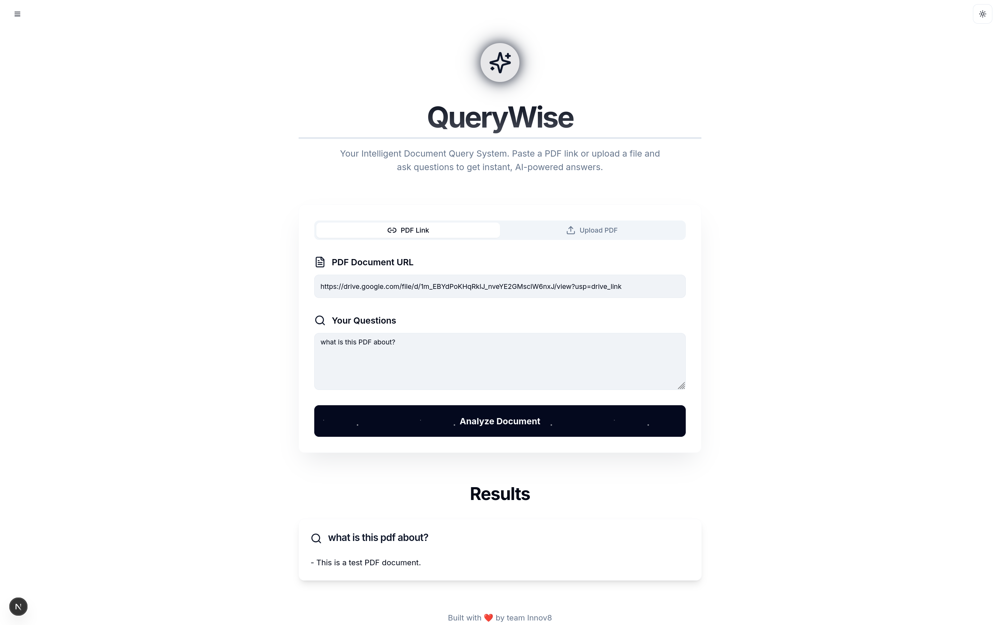
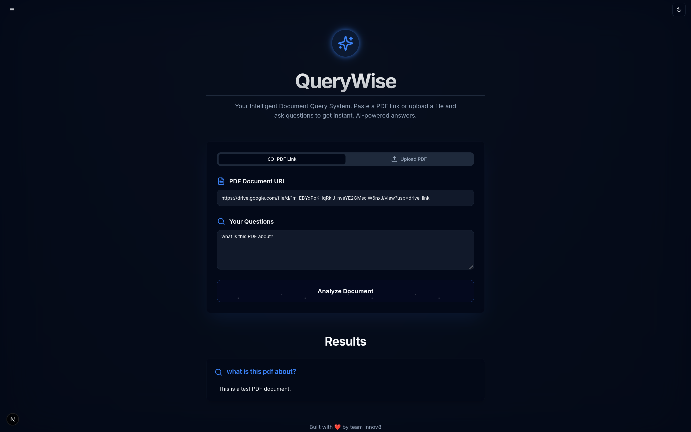
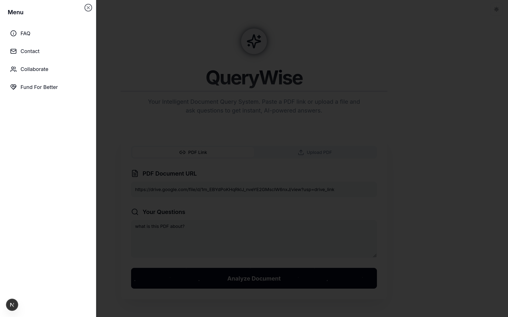
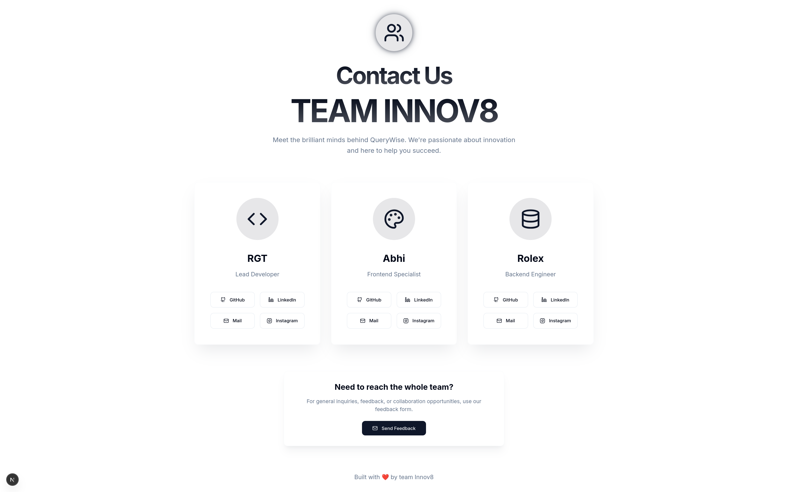

# QueryWise

An intelligent document query system that enables users to upload PDF documents or provide document URLs and ask natural language questions to receive AI-powered answers. Built with a modern tech stack featuring FastAPI backend and Next.js frontend.

## Features

- **Document Processing**: Support for both PDF file uploads and URL-based document ingestion
- **Google Drive Integration**: Automatic transformation of Google Drive sharing URLs to direct download links
- **AI-Powered Q&A**: Uses Google's Gemini 2.0 Flash Lite model for intelligent question answering
- **Vector Search**: FAISS-based vector storage with Jina embeddings for efficient document retrieval
- **Persistent Caching**: Intelligent caching system that stores processed document indexes for faster subsequent queries
- **Modern UI**: Clean, responsive interface with dark/light theme support
- **Real-time Processing**: Concurrent question processing for improved performance
- **Authentication**: Bearer token-based API security
## UI

### Screenshots









## Architecture

### Backend (FastAPI)
- **Framework**: FastAPI with async support
- **Document Processing**: PyMuPDF for PDF parsing
- **Vector Store**: FAISS with Jina embeddings
- **LLM**: Google Generative AI (Gemini 2.0 Flash Lite)
- **Text Splitting**: LangChain's RecursiveCharacterTextSplitter
- **Caching**: File-based persistent indexes with SHA256 hashing

### Frontend (Next.js)
- **Framework**: Next.js 15 with TypeScript
- **UI Components**: Radix UI with Tailwind CSS
- **State Management**: React hooks
- **Theme Support**: next-themes for dark/light mode
- **File Handling**: Native FormData API for file uploads

## Prerequisites

- Python 3.8+
- Node.js 18+
- npm or yarn
- API Keys:
  - Google AI API key (for Gemini)
  - Jina AI API key (for embeddings)

## Installation

### Backend Setup

1. Navigate to the backend directory:
```bash
cd backend
```

2. Install Python dependencies:
```bash
pip install -r requirements.txt
```

3. Create a `.env` file with your API keys:
```env
GOOGLE_API_KEY=your_google_api_key_here
JINA_API_KEY=your_jina_api_key_here
BEARER_TOKEN=your_secure_bearer_token_here
```

4. Start the FastAPI server:
```bash
uvicorn main:app --reload --host 0.0.0.0 --port 8000
```

### Frontend Setup

1. Navigate to the frontend directory:
```bash
cd frontend
```

2. Install Node.js dependencies:
```bash
npm install
```

3. Create a `.env.local` file:
```env
NEXT_PUBLIC_API_URL=http://localhost:8000/hackrx/run
NEXT_PUBLIC_API_TOKEN=your_secure_bearer_token_here
```

4. Start the development server:
```bash
npm run dev
```

The application will be available at `http://localhost:9002`.

## API Endpoints

### POST `/hackrx/run`
Process documents and answer questions.

**Request Body** (multipart/form-data):
- `questions`: Array of strings (questions to ask)
- `file`: PDF file (optional)
- `documents`: Document URL (optional)

**Response**:
```json
{
  "answers": ["Answer 1", "Answer 2", "..."]
}
```

**Authentication**: Bearer token required in Authorization header.

### GET `/`
Health check endpoint.

## Usage

1. **Document Input**: Choose between uploading a PDF file or providing a document URL (including Google Drive links)
2. **Questions**: Enter your questions, one per line
3. **Processing**: The system will:
   - Download/process the document
   - Create vector embeddings (cached for future use)
   - Use RAG (Retrieval-Augmented Generation) to answer questions
4. **Results**: View AI-generated answers with source context

## Key Technologies

- **LangChain**: Document processing and RAG pipeline
- **FAISS**: Vector similarity search
- **Jina Embeddings**: High-quality text embeddings
- **Google Gemini**: Large language model for answer generation
- **Radix UI**: Accessible component library
- **Tailwind CSS**: Utility-first CSS framework

## Performance Features

- **Concurrent Processing**: Multiple questions processed simultaneously
- **Intelligent Caching**: Document indexes persisted to disk
- **Chunking Strategy**: Optimized text splitting (1000 chars, 150 overlap)
- **Retrieval Optimization**: Top-7 relevant chunks for context

## Security

- Bearer token authentication
- Input validation and sanitization
- CORS configuration for frontend communication
- Secure file handling with temporary files

## Development

### Backend Development
```bash
cd backend
uvicorn main:app --reload --host 0.0.0.0 --port 8000
```

### Frontend Development
```bash
cd frontend
npm run dev
```

### Type Checking (Frontend)
```bash
npm run typecheck
```

## Contributing

1. Fork the repository
2. Create a feature branch
3. Make your changes
4. Add tests if applicable
5. Submit a pull request

## License

This project is developed by team Innov8 as a solution to HackRX6.0 Hackathon by Bajaj Finserv.

## Support

For questions or issues, please refer to the application's built-in FAQ section or contact the development team.